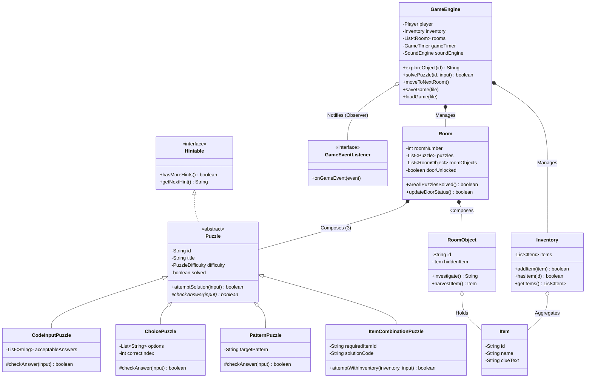

# EscapeX – Intelligent Escape Room Adventure
### *A Pure Core Java (JDK 17+) Desktop Adventure Game & OOP Learning Laboratory*

Welcome to **EscapeX**, an immersive puzzle adventure game built entirely from scratch using only core Java (Standard Edition) and Java Swing. 

Designed specifically for **second-year Artificial Intelligence & Machine Learning (AIML) engineering students**, EscapeX combines engaging game mechanics with clear, production-grade object-oriented software design. Every class is heavily commented and purposefully demonstrates a fundamental Object-Oriented Programming (OOP) principle or Design Pattern.

---

## 🌟 Key Highlights

- **Pure Java / Zero External Dependencies**: 100% built on standard JDK 17+ (Swing, AWT, Sound, Serialization). No Maven, no Gradle, no third-party libraries needed.
- **Built-in Procedural Audio Synthesizer**: Uses `javax.sound.sampled` to mathematically synthesize retro-futuristic sound effects (chimes, clicks, alarms, fanfare) dynamically without requiring any external audio files!
- **Interactive Cyberpunk 2D Canvas**: Custom `Graphics2D` rendering with 30 FPS ambient animations, isometric perspectives, and clickable hotspots with hover tooltips.
- **Save & Load Progress**: Full state persistence using Java Object Serialization (`GameState.java`).
- **Hall of Fame Leaderboard**: Tracks top escapes, scores, and completion times in CSV format.
- **In-Game "OOP Architecture Inspector"**: An interactive educational guide inside the game UI that explains the OOP principles behind every component in the codebase.

---

## 🕹️ Game Storyline & Flow

You are the **Lead AI Safety Engineer** stationed at the *Autonomous AI Containment Facility*. An experimental AI mainframe triggered a security lockdown due to an adversarial prompt injection attack. You are trapped across 5 quarantined sectors:

$$\text{Explore Hotspots} \longrightarrow \text{Collect Inventory Tools} \longrightarrow \text{Inspect Clues} \longrightarrow \text{Solve 3 Diagnostics} \longrightarrow \text{Unlock Blast Door} \longrightarrow \text{Escape!}$$

### The 5 Escape Sectors:
1. **Sector 01: The Cybernetics Workshop** *(Theme: Digital Hardware & Logic Gates)*
   - *Items*: Optical Magnifier, Maintenance Keycard, Digital Logic Manual.
   - *Puzzles*: Boolean Gate Bus (Easy) $\rightarrow$ Binary Memory Register Override (Medium) $\rightarrow$ Micro-Oscillator Frequency Synergizer (Hard).
2. **Sector 02: The Cryptographic Vault** *(Theme: Ciphers & Data Security)*
   - *Items*: Laser Pointer, Caesar Cipher Disc, Encrypted Data Slate.
   - *Puzzles*: Caesar Shift Decryption (Easy) $\rightarrow$ Matrix Transposition Cipher (Medium) $\rightarrow$ Photonic Mirror Code (Hard).
3. **Sector 03: The Neural Core** *(Theme: Machine Learning, Perceptrons & Optimization)*
   - *Items*: Synaptic Weight USB, Activation Function Chart, Logic Probe.
   - *Puzzles*: Perceptron ReLU Feedforward (Easy) $\rightarrow$ Vanishing Gradient Dilemma (Medium) $\rightarrow$ Convergence Weight Injection (Hard).
4. **Sector 04: The Quantum Nexus** *(Theme: Qubits, Superposition & Bell Entanglement)*
   - *Items*: Qubit Polarizer, Entanglement Telemetry Log, Superconducting Solenoid.
   - *Puzzles*: Pauli-X Quantum Gate (Easy) $\rightarrow$ Entangled Bell State Correlation (Medium) $\rightarrow$ Superposition Phase Alignment (Hard).
5. **Sector 05: The Singularity Mainframe** *(Theme: AI Alignment & Final Escape)*
   - *Items*: Asimov Directive Chip, Master Override Token, Quarantine Report.
   - *Puzzles*: Core Alignment Directive (Easy) $\rightarrow$ Adversarial Prompt Defense (Medium) $\rightarrow$ Final Singularity Handshake (Hard).

---

## 🏗️ Architecture & Class Diagram



---

## 📚 Study Notes: OOP Concepts Demonstrated

For 2nd-year AIML students studying Object-Oriented Software Engineering, here is where each core principle is applied in EscapeX:

| OOP Concept | Project Class | Educational Explanation |
| :--- | :--- | :--- |
| **Encapsulation** | [`Player.java`](file:///e:/EscapeX11/src/escapex/model/Player.java), [`Item.java`](file:///e:/EscapeX11/src/escapex/model/Item.java) | Data hiding via `private` fields. State can only be read via getters or modified through validated domain methods (`addScore()`, `recordHintUsed()`). `Item` is an immutable Value Object with zero setters. |
| **Defensive Copying** | [`Inventory.java`](file:///e:/EscapeX11/src/escapex/model/Inventory.java) | `getItems()` returns `Collections.unmodifiableList(items)`. Outside callers cannot tamper with the internal collection without going through `addItem()`. |
| **Inheritance** | [`Puzzle.java`](file:///e:/EscapeX11/src/escapex/model/puzzle/Puzzle.java) & Subclasses | `CodeInputPuzzle`, `ChoicePuzzle`, `PatternPuzzle`, and `ItemCombinationPuzzle` inherit state and behavior from the abstract parent `Puzzle`. |
| **Polymorphism** | [`GameEngine.java`](file:///e:/EscapeX11/src/escapex/service/GameEngine.java) | All 15 puzzles are stored together in `List<Puzzle>`. Calling `puzzle.attemptSolution(input)` triggers dynamic method dispatch to the correct subclass at runtime. |
| **Abstraction** | [`Puzzle.java`](file:///e:/EscapeX11/src/escapex/model/puzzle/Puzzle.java) | Declares abstract method `checkAnswer(input)` and demonstrates the **Template Method Pattern**: `attemptSolution()` handles attempt counts and status changes while delegating answer checks to subclasses. |
| **Interfaces (Contracts)** | [`Hintable.java`](file:///e:/EscapeX11/src/escapex/model/puzzle/Hintable.java), [`GameEventListener.java`](file:///e:/EscapeX11/src/escapex/observer/GameEventListener.java) | Demonstrates the *Interface Segregation Principle* (SOLID) and decouples the Game Engine from the Swing GUI. |
| **Composition vs Aggregation** | [`Room.java`](file:///e:/EscapeX11/src/escapex/model/Room.java), [`Inventory.java`](file:///e:/EscapeX11/src/escapex/model/Inventory.java) | "Favor composition over inheritance." A Room *HAS-A* collection of Puzzles; it does not inherit from them. |
| **Custom Exceptions** | [`EscapeXException.java`](file:///e:/EscapeX11/src/escapex/exception/EscapeXException.java), [`RoomLockedException.java`](file:///e:/EscapeX11/src/escapex/exception/RoomLockedException.java) | Defines a specialized domain exception hierarchy, allowing UI handlers to differentiate between locked doors and save file errors. |
| **File I/O & Serialization** | [`GameState.java`](file:///e:/EscapeX11/src/escapex/model/GameState.java), [`SaveLoadService.java`](file:///e:/EscapeX11/src/escapex/service/SaveLoadService.java) | Demonstrates the **Memento Pattern** and Java object graph serialization with `ObjectOutputStream` / `ObjectInputStream`. |
| **Resource Management** | [`HighScoreService.java`](file:///e:/EscapeX11/src/escapex/service/HighScoreService.java) | Demonstrates `try-with-resources` to ensure OS file streams are cleanly closed without leaks. |

---

## 🎨 Design Patterns Catalog

1. **Model-View-Controller (MVC)**:
   - **Model**: `Room`, `Puzzle`, `Player`, `Inventory` (Encapsulates state & game rules).
   - **View**: `EscapeXFrame`, `RoomViewPanel`, `InventoryPanel`, `TerminalPanel` (Renders UI).
   - **Controller / Facade**: `GameEngine` (Coordinates state mutations and updates observers).
2. **Observer Pattern**:
   - `GameEngine` publishes `GameEvent` notifications.
   - Any class implementing `GameEventListener` (`TerminalPanel`, `EscapeXFrame`, `InventoryPanel`) automatically reacts to events without tight coupling.
3. **Factory Pattern**:
   - `RoomFactory` encapsulates the complex construction of all 5 sectors, 15 puzzles, and narrative lore.
4. **Singleton Pattern**:
   - `SoundEngine` ensures only one instance controls computer audio hardware.
5. **Strategy / Template Method Pattern**:
   - `Puzzle.attemptSolution()` provides the skeleton algorithm, while subclasses supply the answer verification strategy.

---

## 🚀 How to Compile & Run

### Method 1: Easy 1-Click Scripts (Windows)
- Double-click **`compile.bat`** to compile the source code into `bin/`.
- Double-click **`run.bat`** to launch the game!

### Method 2: PowerShell
```powershell
.\build_and_run.ps1
```

### Method 3: Command Prompt (Manual)
```cmd
javac -encoding UTF-8 -d bin -sourcepath src src/escapex/Main.java
java -cp bin escapex.Main
```

### Running the Automated Smoke Test
To verify all game mechanics and puzzle solutions in headless mode:
```cmd
javac -cp bin -sourcepath src -d bin src/escapex/SmokeTest.java
java -cp bin escapex.SmokeTest
```

---

## 🔍 Master Solution Cheat Sheet (Walkthrough)

| Sector | Fixture to Explore | Item Collected | Puzzle 1 (Easy) | Puzzle 2 (Medium) | Puzzle 3 (Hard) |
| :--- | :--- | :--- | :--- | :--- | :--- |
| **01. Cybernetics** | Circuit Workbench | Optical Magnifier | Code: `1` (or `HIGH`) | Code: `75` (or `K`) | Item: `magnifier` + Code: `4096` |
| **02. Crypto Vault** | Magnetic Tape Drives | Laser Pointer | Code: `ESCAPE` (or `ECPAET`) | Code: `CHNYEEPRT` | Item: `laser_pointer` + Code: `MIRROR-45` |
| **03. Neural Core** | Synaptic Column | Weight USB | Code: `3` (or `3.0`) | Choice: `B` (ReLU) | Item: `weight_usb` + Code: `0.001` |
| **04. Quantum Nexus** | Dilution Refrigerator| Qubit Polarizer | Choice: `B` (\|1\>) | Code: `-1` (or `DOWN`) | Item: `polarizer` + Code: `45` |
| **05. Singularity** | Quarantine Pedestal | Master Override Token | Choice: `B` (Human Intent/Safety) | Code: `Prompt Injection` | Item: `master_token` + Code: `ESCAPE-X` |

---

*Engineered with clean code, passion for teaching, and pure Java.*
